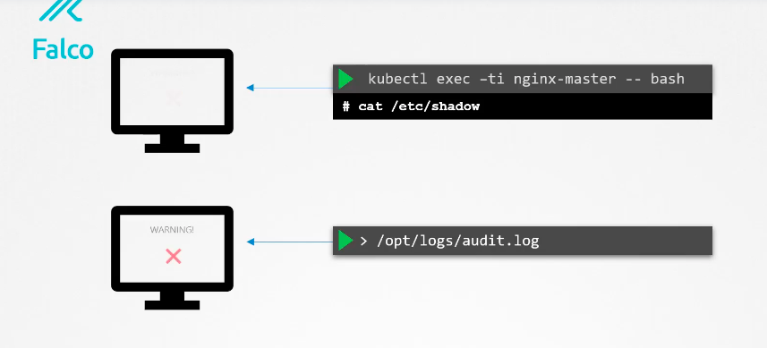

# CKS

## Kubernetes security category 

<ol>
  <li>Host Os level </li>
  <li>Kubernetes cluster Level </li>
  <li>Application Level </li>

</ol>

### Host OS level security 

<ol>
  <li>Minion nodes should do only kubernetes things </li>
  <li>Reduce attack surface : By reducing unnecessary application , keep things up to date </li>
  <li>Runtime security tools </li>
  <li>Restrict access to Minion Host : IAM or SSH </li>
</ol>


## Cloud Native Security 

<ol>
  <li>Cloud</li>
  <li>Container</li>
  <li>Cluster</li>
  <li>Code</li>
</ol>


## Cluster Hardening points

<ol>
  <li>CIS Benchmark </li>
  <li>Node Metadata and Endpoints protection </li>
  <li>DashBoard Security </li>
  <li>UPgrading Cluster</li>
  <li>Securing Images</li>
  <li>Network Policies </li>
</ol>

## scaning container image 

### Trivy 

### scan image 

```
trivy image  python:3.6.12-alpine3.11

```

### scan image with specific severity 

```
trivy image --severity HIGH  --output python1.txt  python:3.6.12-alpine3.11 
```

## Note: we can scan image tar also 

```
trivy image --input /root/alpine.tar   --format  json  --output alpine.json
```

### using Falco to detects threats 

### iNstalled falco and check service using systemctl 

### falco monitor 




### capture logs using journalctl 

```
journalctl  -fu falco 
-- Logs begin at Sun 2022-04-03 01:13:06 UTC. --
Apr 03 01:49:31 controlplane falco[5634]: Falco initialized with configuration file /etc/falco/falco.yaml
Apr 03 01:49:31 controlplane falco[5634]: Loading rules from file /etc/falco/falco_rules.yaml:
Apr 03 01:49:31 controlplane falco[5634]: Loading rules from file /etc/falco/falco_rules.local.yaml:
Apr 03 01:49:31 controlplane falco[5634]: Sun Apr  3 01:49:31 2022: Loading rules from file /etc/falco/falco_rules.local.yaml:
Apr 03 01:49:31 controlplane falco[5634]:
```


