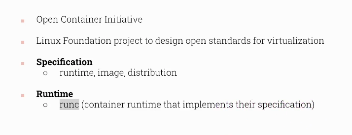
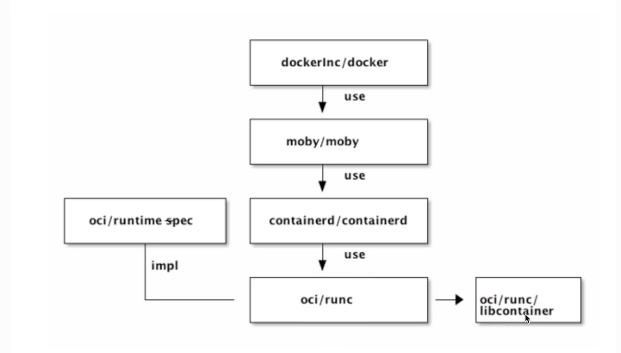
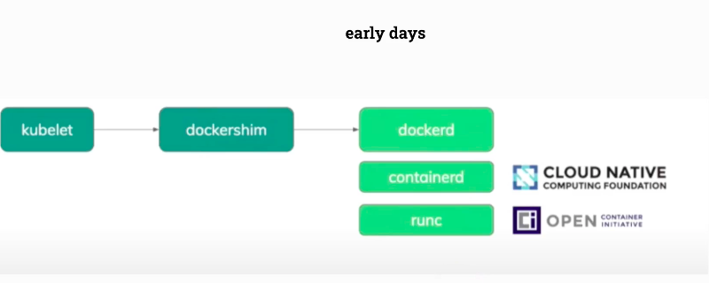
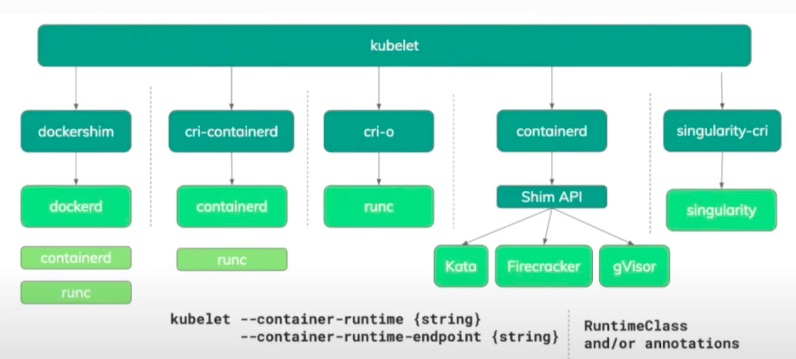
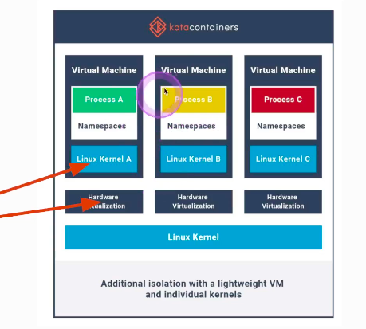
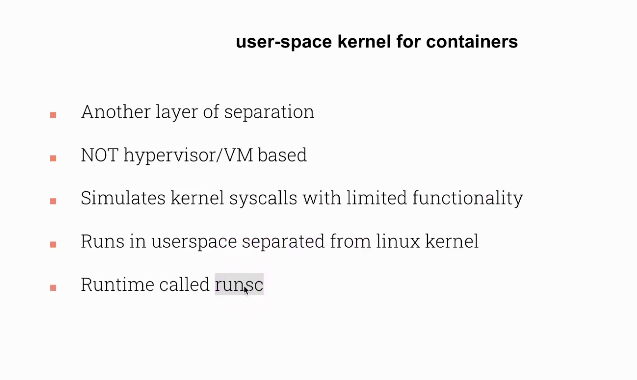

# CKS

## Kubernetes security category 

<ol>
  <li>Host Os level </li>
  <li>Kubernetes cluster Level </li>
  <li>Application Level </li>

</ol>

### Host OS level security 

<ol>
  <li>Minion nodes should do only kubernetes things </li>
  <li>Reduce attack surface : By reducing unnecessary application , keep things up to date </li>
  <li>Runtime security tools </li>
  <li>Restrict access to Minion Host : IAM or SSH </li>
</ol>

## Cloud Native Security 

<ol>
  <li>Cloud</li>
  <li>Container</li>
  <li>Cluster</li>
  <li>Code</li>
</ol>

## Cluster Hardening points

<ol>
  <li>CIS Benchmark </li>
  <li>Node Metadata and Endpoints protection </li>
  <li>DashBoard Security </li>
  <li>UPgrading Cluster</li>
  <li>Securing Images</li>
  <li>Network Policies </li>
</ol>

# OCI [open container initiative]

## a project by LF to set standards and specifications for container and images 

## any runtime engine sending instruction to RUNC

## early days how k8s --kubelet was creating container 

### CRI (container runtime interface ) how kubelet using CRI to create container 

## COntainer sandbox using kata containers 

### container sanboxing using gVisor 

### more info 

