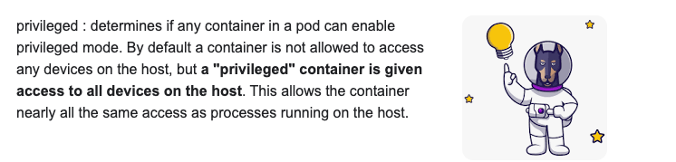
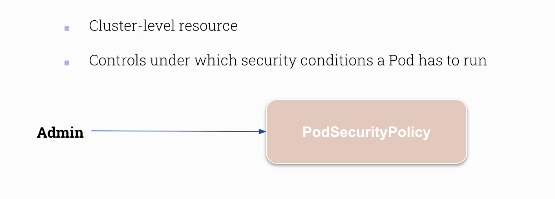

# CKS

## Kubernetes security category 

<ol>
  <li>Host Os level </li>
  <li>Kubernetes cluster Level </li>
  <li>Application Level </li>

</ol>

### Host OS level security 

<ol>
  <li>Minion nodes should do only kubernetes things </li>
  <li>Reduce attack surface : By reducing unnecessary application , keep things up to date </li>
  <li>Runtime security tools </li>
  <li>Restrict access to Minion Host : IAM or SSH </li>
</ol>


## Cloud Native Security 

<ol>
  <li>Cloud</li>
  <li>Container</li>
  <li>Cluster</li>
  <li>Code</li>
</ol>


## Cluster Hardening points

<ol>
  <li>CIS Benchmark </li>
  <li>Node Metadata and Endpoints protection </li>
  <li>DashBoard Security </li>
  <li>UPgrading Cluster</li>
  <li>Securing Images</li>
  <li>Network Policies </li>
</ol>

## OS level security --

### Privileged containers 

---> a container that can run with host root privileged 



### privilege escallation 


### POd security POlicy 



### allow podsecuritypolicy 

```
[root@ip-172-31-90-99 manifests]# grep -i enable kube-apiserver.yaml  -n
20:    - --enable-admission-plugins=NodeRestriction
21:    - --enable-bootstrap-token-auth=true

[root@ip-172-31-90-99 manifests]# vim +20 /etc/kubernetes/manifests/kube-apiserver.yaml 
[root@ip-172-31-90-99 manifests]# grep -i enable kube-apiserver.yaml  -n
20:    - --enable-admission-plugins=NodeRestriction,PodSecurityPolicy
21:    - --enable-bootstrap-token-auth=true

```

### create pod secruity POlicy 

```
 k apply -f podsecpoly.yaml 
Warning: policy/v1beta1 PodSecurityPolicy is deprecated in v1.21+, unavailable in v1.25+
podsecuritypolicy.policy/testpol configured
fire@ashutoshhs-MacBook-Air CKS % 
fire@ashutoshhs-MacBook-Air CKS % 
fire@ashutoshhs-MacBook-Air CKS % k get podsecuritypolicy 
Warning: policy/v1beta1 PodSecurityPolicy is deprecated in v1.21+, unavailable in v1.25+
NAME      PRIV    CAPS   SELINUX    RUNASUSER   FSGROUP    SUPGROUP   READONLYROOTFS   VOLUMES
testpol   false          RunAsAny   RunAsAny    RunAsAny   RunAsAny   false            *
fire@ashutoshhs-MacBook-Air CKS % 

```

## Important: we can only create Pods and not deployment 

### we have to allow service accounts to use podsecuirty policy 

### create role and bind it to service account 

```
k create role podsecpol-access1 --verb=use --resource=podsecuritypolicies
 k create rolebinding podsecbind2 --role=podsecpol-access1 --serviceaccount=ashu-space:default
```

### Now we can create deployments also 

## Kernel vs user space --


### seccom profile --


