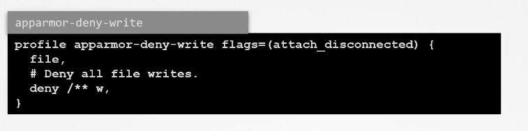
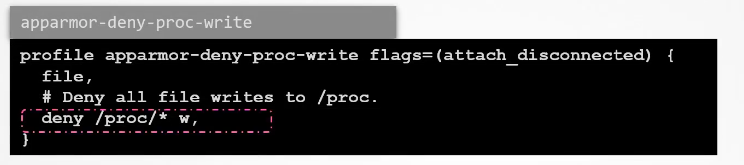
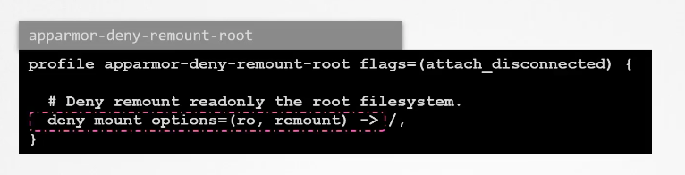

## Important commands 

### check profile list 

```
root@ip-172-31-25-185:~# aa-status 
apparmor module is loaded.
32 profiles are loaded.
30 profiles are in enforce mode.
   /snap/snapd/18596/usr/lib/snapd/snap-confine
   /snap/snapd/18596/usr/lib/snapd/snap-confine//mount-namespace-capture-helper
   /usr/bin/man

```

### TO use more uitlity like creating profile we can use some tools -- lets install it 

```
root@ip-172-31-25-185:~# apt install apparmor-utils 
Reading package lists... Done
Building dependency tree       
Reading state information... Done
The following additional packages will be installed:
  python3-apparmor python3-libapparmor
Suggested packages:
  vim-addon-manager

```

### Generating profile for curl command 

```
root@ip-172-31-25-185:~# aa-genprof curl 
Writing updated profile for /usr/bin/curl.
Setting /usr/bin/curl to complain mode.

Before you begin, you may wish to check if a
profile already exists for the application you
wish to confine. See the following wiki page for
more information:
https://gitlab.com/apparmor/apparmor/wikis/Profiles

Profiling: /usr/bin/curl

```

### lets test curl -- by default we didn't allowed any thing to curl so 

```
root@ip-172-31-25-185:/etc/apparmor.d# curl ifconfig.me -v
* Could not resolve host: ifconfig.me
* Closing connection 0
curl: (6) Could not resolve host: ifconfig.me

```


### Profile are stored in 

```
root@ip-172-31-25-185:~# cd  /etc/app
apparmor/   apparmor.d/ apport/     
root@ip-172-31-25-185:~# cd  /etc/app
apparmor/   apparmor.d/ apport/     
root@ip-172-31-25-185:~# cd  /etc/apparmor.d/
root@ip-172-31-25-185:/etc/apparmor.d# ls
abstractions  force-complain  lsb_release      sbin.dhclient  usr.bin.curl  usr.lib.snapd.snap-confine.real  usr.sbin.tcpdump
disable       local           nvidia_modprobe  tunables       usr.bin.man   usr.sbin.rsyslogd
root@ip-172-31-25-185:/etc/apparmor.d# 

```

### changing profile modes 

```
 aa-complain  /usr/bin/curl 
   80  curl ifconfig.me -v
   81  curl ifconfig.me
   82  aa-enforce /usr/bin/curl 
```

## How profile look like 

### default write deny 



### one more rule 



### remount of root fs deny 




