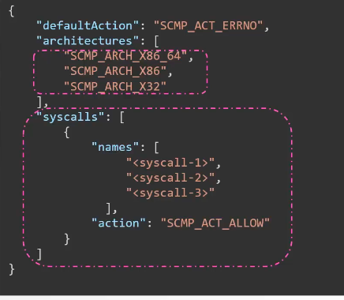
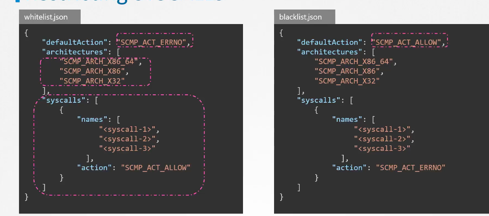
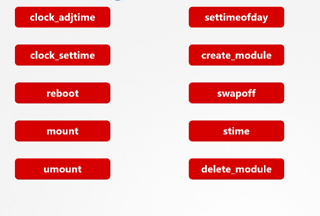
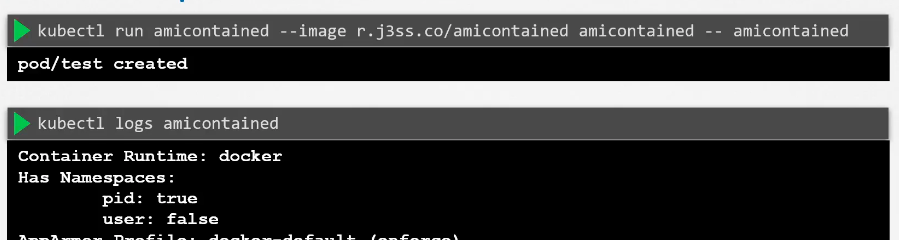
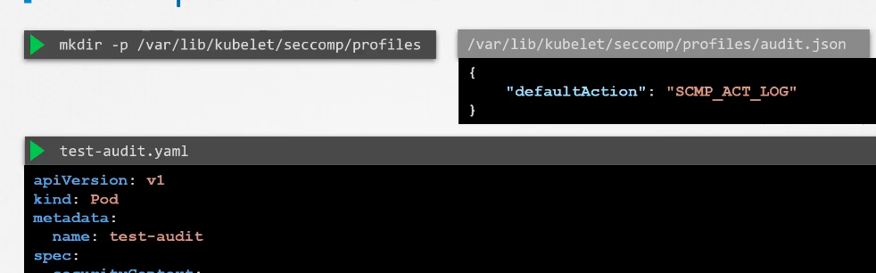
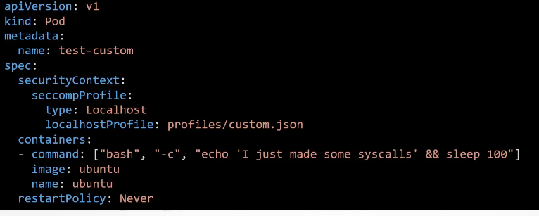

## Understanding syscalls in linux 

### User space vs kernel space


### How any user space operation is using syscall to let the kernel know 


### Demo of tracing a syscal 

```
root@ip-172-31-21-222:~# strace -c touch  /tmp/hello1.txt 
% time     seconds  usecs/call     calls    errors syscall
------ ----------- ----------- --------- --------- ----------------
  0.00    0.000000           0         3           read
  0.00    0.000000           0        22           close
  0.00    0.000000           0        18           fstat
  0.00    0.000000           0        22           mmap
  0.00    0.000000           0         3           mprotect
  0.00    0.000000           0         1           munmap
  0.00    0.000000           0         3           brk
  0.00    0.000000           0         6           pread64
  0.00    0.000000           0         1         1 access
  0.00    0.000000           0         1           dup2
  0.00    0.000000           0         1           execve
  0.00    0.000000           0         2         1 arch_prctl
  0.00    0.000000           0        19           openat
  0.00    0.000000           0         1           utimensat
------ ----------- ----------- --------- --------- ----------------
100.00    0.000000                   103         2 total

```

### Time for Restricing syscall used by any program 

### list of some syscall made use by any program 


### checking syscall support in linux kernel 

```
root@ip-172-31-21-222:~# grep -i seccomp  /boot/config-$(uname -r)
CONFIG_HAVE_ARCH_SECCOMP=y
CONFIG_HAVE_ARCH_SECCOMP_FILTER=y
CONFIG_SECCOMP=y
CONFIG_SECCOMP_FILTER=y
# CONFIG_SECCOMP_CACHE_DEBUG is not set
```

## see a demo or syscall 

### creating container and try to change time 

```
root@ip-172-31-21-222:~# docker run -it --rm  docker/whalesay  sh 
# date -s "19 april 2022 18:19:09"
date: cannot set date: Operation not permitted
Tue Apr 19 18:19:09 UTC 2022
# date
Fri Apr 14 01:13:24 UTC 2023
# 

```

### checking seccomp status 

```
# ps -ef
UID          PID    PPID  C STIME TTY          TIME CMD
root           1       0  0 01:12 pts/0    00:00:00 sh
root           9       1  0 01:14 pts/0    00:00:00 ps -ef
# grep -i seccomp  /proc/1/status
Seccomp:	2
Seccomp_filters:	1
# 

```

### First understand that seccomp modes


### seccomp profile look like 



### default allow & block syscall profile 



## Note: 

### Docker by default block these many syscall 



### creating container with no seccomp profile 

```
root@ip-172-31-21-222:~# docker run -it --rm   --security-opt  seccomp=unconfined  docker/whalesay  sh 
```

### passing custom seccomp profile and block mkdir syscall

```
root@ip-172-31-21-222:~# docker run -it --rm --security-opt seccomp=/root/custom1.json alpine sh
/ # mkdir hello
mkdir: can't create directory 'hello': Operation not permitted
```

### How to check default block syscall by docker 

```
root@ip-172-31-21-222:~# docker run --rm r.j3ss.co/amicontained amicontained
Container Runtime: docker
Has Namespaces:
	pid: true
	user: false
AppArmor Profile: docker-default (enforce)
Capabilities:
	BOUNDING -> chown dac_override fowner fsetid kill setgid setuid setpcap net_bind_service net_raw sys_chroot mknod audit_write setfcap
Seccomp: filtering
Blocked Syscalls (61):
	MSGRCV SYSLOG SETPGID SETSID USELIB USTAT SYSFS VHANGUP PIVOT_ROOT _SYSCTL ACCT SETTIMEOFDAY MOUNT UMOUNT2 SWAPON SWAPOFF REBOOT SETHOSTNAME SETDOMAINNAME IOPL IOPERM CREATE_MODULE INIT_MODULE DELETE_MODULE GET_KERNEL_SYMS QUERY_MODULE QUOTACTL NFSSERVCTL GETPMSG PUTPMSG AFS_SYSCALL TUXCALL SECURITY LOOKUP_DCOOKIE CLOCK_SETTIME VSERVER MBIND SET_MEMPOLICY GET_MEMPOLICY KEXEC_LOAD ADD_KEY REQUEST_KEY KEYCTL MIGRATE_PAGES UNSHARE MOVE_PAGES PERF_EVENT_OPEN FANOTIFY_INIT NAME_TO_HANDLE_AT OPEN_BY_HANDLE_AT SETNS PROCESS_VM_READV PROCESS_VM_WRITEV KCMP FINIT_MODULE KEXEC_FILE_LOAD BPF USERFAULTFD PKEY_MPROTECT PKEY_ALLOC PKEY_FREE
Looking for Docker.sock
```

### checking in k8s 



### Onk8s nodes we have to create these folders 



### using custom profile 



